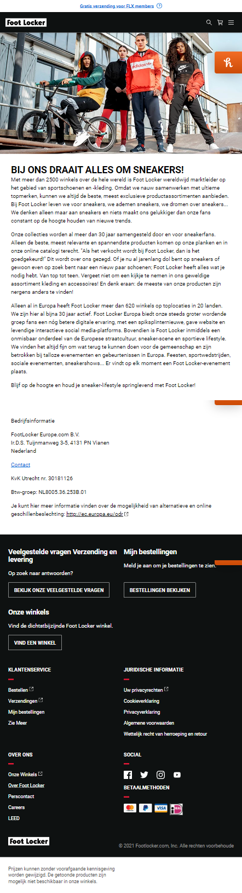
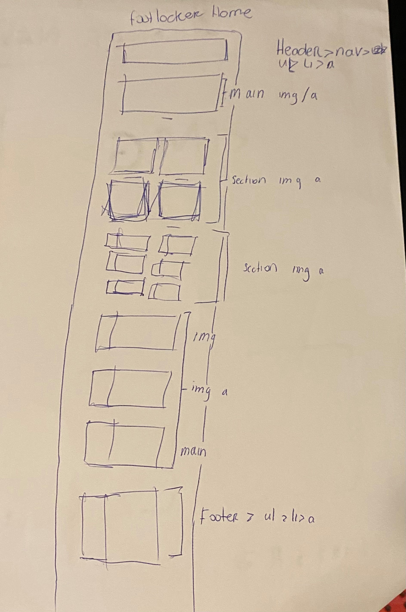
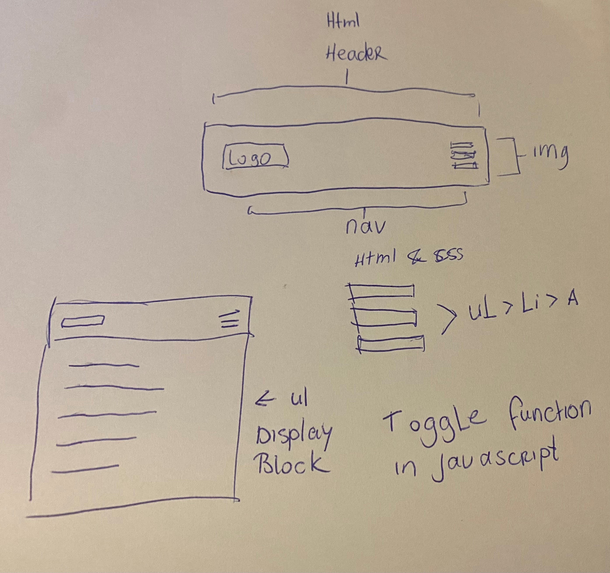
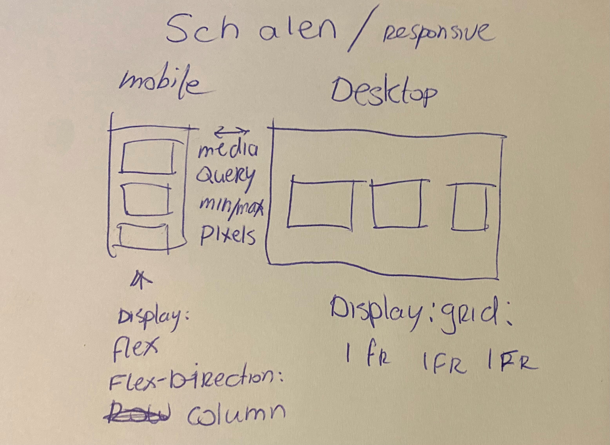
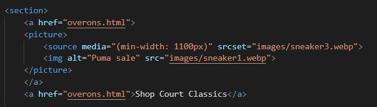
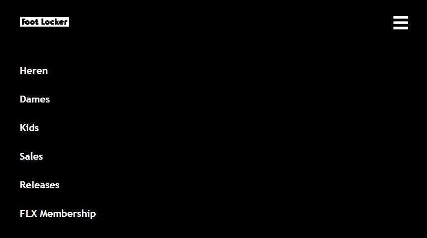
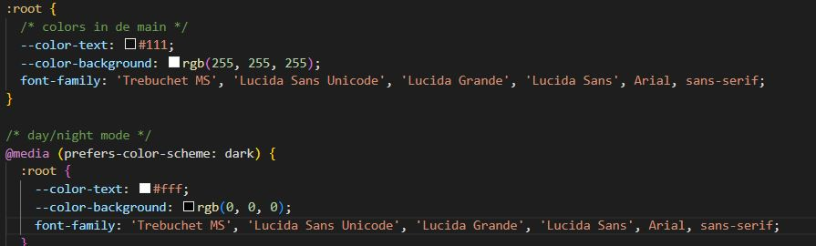
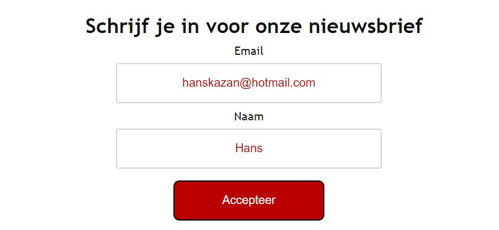

# Procesverslag
Markdown is een simpele manier om HTML te schrijven.  
Markdown cheat cheet: [Hulp bij het schrijven van Markdown](https://github.com/adam-p/markdown-here/wiki/Markdown-Cheatsheet).

Nb. De standaardstructuur en de spartaanse opmaak van de README.md zijn helemaal prima. Het gaat om de inhoud van je procesverslag. Besteedt de tijd voor pracht en praal aan je website.

Nb. Door *open* toe te voegen aan een *details* element kun je deze standaard open zetten. Fijn om dat steeds voor de relevante stuk(ken) te doen.

## Jij

  
uitwerken voor kick-off werkgroep

  ### Auteur:
  Atakan

  #### Je startniveau:
  Blauw

  #### Je focus:
  Responsive met bling bling elementen
 

## Je website

  
footlocker

  ### Je opdracht:
  www.footlocker.nl

  #### Screenshot(s) van de eerste pagina (small screen): 
  Home
  

  #### Screenshot(s) van de tweede pagina (small screen):
  Over ons 
  
 

## Toegankelijkheidstest 1/2 (week 1)

  
Tijdens de toegankelijkheidstest hebben we meerdere objecten gebruikt waarbij we simuleren hoe het is om een beperking te hebben, denk hierbij aan zicht, parkinsons/spasme en soorten blindheid

  ### Bevindingen
  Lijst met je bevindingen die in de test naar voren kwamen: Blinden en of slechtzienden hebben verschillende soorten resultaten: je kan bijvoorbeeld alleen op een klein punt focussen en ziet verder niks meer om je heen, De website van footlocker kan druk ervaren worden, dat maakt het voor slechtzienden heel erg lastig om te zien waar ze gebleven zijn er zijn veel images en secties.
  
  Parkinson/spasmes heb ik zelf niet gedaan maar dit heb ik geobserveert bij een klasgenoot, hieruit kan ik concluderen dat het vrijwel onmogelijk is dat iemand met zware parkinsons een website kan gebruiken.

  #### Screenreader
  Een screenreader leest de HTML structuur zodat een blind of slechtziend persoon makkelijker gebruik kan maken van computers en smartphones.
  Op de site van footlocker maakt goed gebruik van de screenreader echter is de site best druk en kan de gebruiker overbelast worden met veel audio en zal de user veel moeten tabben om te komen waar hij/zij hoort te zijn. Dit vond ik fijn om te kunnen gebruiken maar er zijn momenten geweest waarbij ik lekker door wilde gaan naar een ander gedeelte van de website, dat duurde te lang. Hiervoor kan je het skippen van bepaalde elementen wat toegankelijker maken.

  #### Muis en Toetsenbord 
  De website van footlocker heeft heel veel content, daarmee wil ik zeggen dat het moeilijk bij te houden is waar je bent. Iemand met concentratie problemen gaat snel de draad kwijtraken kwam ik achter. je bent hier dus ook veel tijd mee kwijt om erachter te komen waar je gebleven was footlocker heeft dan alleen de standaard instellingen als je bijvoorbeeld gaat tabben, daardoor valt het niet zo snel op en kan het nog langer duren.

  #### Motoriek (shocks, elastiekjes)
  Hier heb ik niet aan deelgenomen, echter wel geobserveerd. Voor de user is het onmogelijk om gebruik te maken van een telefoon op computer door de spasmes. veel kan je er niet aan doen, je kan users met parkinsons wel grotere buttons geven om een knop bijvoorbeeld makkelijker klikbaar te maken of goed gebruik maken van tabs en de states daarvan.

  #### Visueel (brillen, contrast, kleurenblind, dark/light). 
  Visuele beperkingen verschillen de een ziet een klein punt en verder niet, de ander is natuurlijk kleurenblind en sommige hebben zelfs een soort vlek in hun zicht.
  hiervoor moet je breed gaan nadenken voor iedereen. Tijdens de tests heb ik zelf ervaren dat het lastig is om een deel van je zicht niet meer te kunnen zien, ik ervaarde een tijd en verloor eigenlijk snel mijn concentratie. Op momenten dat ik me kon focussen kreeg ik het wel voor elkaar 

## Breakdownschets (week 1)

  
uitwerken na afloop 2e werkgroep

  ### de hele pagina: 
  

  ### dynamisch deel (bijv menu): 
  

  ### wellicht nog een dynamisch deel (bijv filter): 
  

## Voortgang 1 (week 2)

  
uitwerken voor 1e voortgang

  ### Stand van zaken
  overstappen van een all div naar sections en articles in combinatie met geen of weinig gebruik van classes en ids is een moeilijke overstap voor mij persoonlijk, ook   opletten op semantiek ervaar ik als lastig en zal hier verder naar vragen. Overigens zou ik meer willen weten over de responsiveness van een site.

  ### Agenda voor meeting
  Atakan Ekinci (niet alle groepleden waren aanwezig, daarom heb ik dit op eigen intiatief gedaan)
  VRAGEN:
  •Pas ik de juiste semantiek toe? Zo nee wat doe ik verkeerd en wat kan beter.
  •Hoe maak ik een website responive?
  •Hoe zorg ik ervoor dat een image veranderd op basis van van schermgrootte?
  ### Verslag van meeting
  hier na afloop snel de uitkomsten van de meeting vastleggen
  
  Tijdens de eerste meeting kwam ik er snel achter dat ik had moeten beginnen op kleine scherm, ik heb me aan de situatie aangepast en heb ontdekt dat ik media querys kan gebruiken op dit soort momenten. Wat betreft de semantiek heb ik geleerd dat ik een W3C controlle heb waarbij er gekeken word naar de semantiek in het programma waarin ik werk, dat ga ik proberen vaker te gebruiken. Vasilis heeft mij mooi uitgelegd dat ik  picture element moest opzoeken, dat heb ik gedaan en vond meteen het antwoord waar ik naar opzoek was.
  
  

## Voortgang 2 (week 3)

  
uitwerken voor 2e voortgang

  ### Stand van zaken
  hier dit ging goed & dit was lastig (neem ook screenshots op van delen van je website en code)

  ### Agenda voor meeting
  samen met je groepje opstellen
  
  Voor het voortgangsgesprek van week 2 had ik verder geen vragen waarbij ik ergens vastliep, Mijn doel was om met Vasilis de code door te lopen en de website te checken op de functionaliteiten en responsiveness. Hier kreeg ik te horen dat ik goed bezig was, er verder geen commentaar was en dat ik zo lekker door moest blijven gaan.

  ### Verslag van meeting
  hier na afloop snel de uitkomsten van de meeting vastleggen
   
  Ik heb te horen gekregen dat ik goed bezig ben en dat ik zo door moet gaan, na afloop heb ik dat ook zeker gedaan.

## Toegankelijkheidstest 2/2 (week 4)

  
uitwerken na test in 8e werkgroep

  ### Bevindingen
  Lijst met je bevindingen die in de test naar voren kwamen (geef ook aan wat er verbeterd is):

  #### Screenreader
  De sreenreader functie doet het op de website van footlocker naar behoren, je krijgt te horen op welk bepaalt punt je heen gaat veel alternatieve teksten zodat niet denkt "waar ben ik nou". Dit heb ik ook aangehouden in mijn site en functioneert net als op de website van footlocker. Echter word er op de site van footlocker te veel gebruik gemaakt van divjes, dit kan ervoor zorgen dat er op onlogische wijze doorheen word gelezen!
Eventuele oplossing: Als je geen interesse hebt in bepaalde elementen maar die gedwongen toch moet doorgaan kan je eventueel ervoor zorgen dat onrelevante of de minstbelangrijke onderdelen overgeslagen worden.

  #### Muis en Toetsenbord 
  Het gebruik van de muis en toetsenbord per beperking verschilt enorm, als je slechtziend bent of kleurenblind kan je bijvoorbeeld nog een formulier invullen of         navigeren door de site. Met een motorieke beperking bleef dit wel lastig. Ik heb mij ook voorgenomen om meer nadruk te leggen op het tabben door mijn site heen zodat   de gebruiker in iedergeval duidelijk kan zien waar hij/zij is.

  #### Motoriek (shocks, elastiekjes)
  Ik heb bij deze test de elastiekjes gebruikt op mobile en desktop, hieruit blijkt dat het moeilijker is te gebruiken met een trackpad. Trackpads maken gebruik van     shortcuts met meerdere vingers bijvoorbeeld 2 vingers kan je gebruiken om te scrollen, Het kwam vaak voor dat ik in conflict was met de trackpad. Op mobile was het     gebruik fijn en werkte alles naar behoren.

  #### Visueel (brillen, contrast, kleurenblind, dark/light). 
  Door het gebruik van brillen kwam ik op het zelfde probleem wat footlocker heeft, tekst linkjes en klikbare images moeten nog duidelijker zijn. In de huidige staat     moet hier nog aan gewerkt worden.

## Voortgang 3 (week 4)

  
uitwerken voor 3e voortgang

  ### Stand van zaken
  hier dit ging goed & dit was lastig (neem ook screenshots op van delen van je website en code)
  

  ### Agenda voor meeting
  samen met je groepje opstellen
  VRAGEN:
  •Geen
  
  bij het laatste gesprek was ik op gang en had verder geen vragen, de vragen die ik had heb ik gesteld in de les aan de student assistenten. De vraag ging               voornamelijk over hoe je dark en night mode kan toepassen op basis van je systeem voorkeur. ik wilde bij het voortgangs gesprek verder werken en als ik ergens         vastliep dan vragen te stellen.
  
  ### Verslag van meeting
  hier na afloop snel de uitkomsten van de meeting vastleggen
  
  Ik heb verder gewerkt aan bepaalde states om nadruk te leggen op users die gebruik maken van tab en afhankelijk zijn van button states.

## Eindgesprek (week 5)

  
uitwerken voor eindgesprek

  ### Je uitkomst - karakteristiek screenshots:
  
   Korte omschrijving met plaatjes
  •Mijzelf anders te laten denken dan alleen divjes, 
  •Het toepasselijk gebruiken van classes,
  •Knokken om te coderen, het gewoon doen en niet te zeuren.
  •HEEL VEEL VREUGDE IN MOMENTEN ALS ALLES LUKTE!!!!!

  ### Dit ging goed/Heb ik geleerd: 
  <!-- Wat ging er goed -->
  Korte omschrijving met plaatjes
  •Mijzelf anders te laten denken dan alleen divjes, 
  •Het toepasselijk gebruiken van classes,
  •Knokken om te coderen, het gewoon doen en niet te zeuren.
  •HEEL VEEL VREUGDE IN MOMENTEN ALS ALLES LUKTE!!!!!
  

    
     ### Dit heb ik geleerd
    •Media querys 
    
    •Picture element
    •Dropdown menu 
      
    •Day & night mode 
    •Var colors 
    •Forms 
    •Errors voorkomen dmv W3C validation in het programma
    •NOG MEEER BUTTON STATES, GOOD STUFF!!!!
    

  

  ### Dit was lastig/Is niet gelukt:
   <!-- Wat was lastig -->
    •	De footer van footlocker is nogal druk, het heeft meerdere buttons en kopjes. Dit wilde ik ook namaken maar door tijdsdruk heb ik ervoor gekozen om het simpel te houden met de informatie die er in moet staan.
    •	Forms toepassen, in een form de button een link geven werkt heel anders dan bijvoorbeeld een list item in de nav, Ik ben wel blij dat het uiteindelijk is gelukt.
    •	Het maken van de hamburger menu bleek lastiger dan ik dacht, en ben er nog steeds bang voor(java & css).
    • Desondanks dat het gelukt is had ik aan het begin wel moeite met de media querys, door het vaker toe te passen begon ik het duidelijker te vinden.

  
   <!-- Wat was niet gelukt -->
    •Searchbar, sommige onderdelen had ik onderschat vooralsnog wilde ik het proberen om bling bling en responsive te combineren
    •Betere vormgeving, ik moet de situatie soms accepteren voor wat het is. Als iets goed genoeg is wil ik het alsnog verbeteren, dit werkt averechts.
    •Meer gebruik van javascript, Het is iets waar ik alsnog lastig blijf vinden. Soms heb ik een gaaf idee en blijkt dat te complex te zijn voor mijn doen, daar maak      ik dan de keuze om dat te laten liggen omdat het te lang gaat duren en ga naar andere oplossingen/opties zoeken om een soortgelijk resultaat te behalen
    •Skip to main content
  

## Bronnenlijst

  
continu bijhouden terwijl je werkt

      Voor alle fotos: https://www.footlocker.nl/
      Groene vink op de verassings page: https://commons.wikimedia.org/wiki/File:Eo_circle_green_checkmark.svg
      Day/night mode: https://developer.mozilla.org/en-US/docs/Web/CSS/@media/prefers-color-scheme (met hulp van de student assistent)
      Form > button linken: https://www.w3docs.com/snippets/html/how-to-create-an-html-button-that-acts-like-a-link.html
      Media query: https://www.w3schools.com/css/css_rwd_mediaqueries.asp (met hulp van de student assistent)
      flexbox froggy: https://flexboxfroggy.com/#nl (om flexbox beter te kunnen snappen)
      Animatie https://www.w3schools.com/css/css3_2dtransforms.asp (denk bijvoorbeeld aan skewY en TransformY)
      Opdrachten die op DLO stonden met informeren over vormgeving binnen css: https://dlo.mijnhva.nl/d2l/le/content/437097/Home

